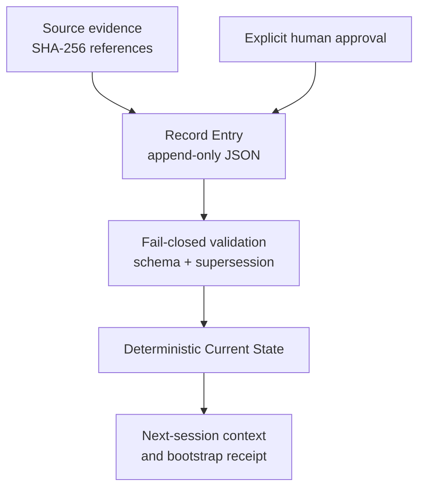

# The Record

[](https://github.com/daytona3dan-coder/the-record-method/actions/workflows/record-ci.yml)
[](LICENSE)

**The Record is a repository-backed continuity and governance system for human-directed work with AI.**

It turns decisions, operational state, evidence references, and unresolved work into structured, append-only JSON entries. Deterministic scripts validate those entries, apply explicit supersession, rebuild current state, and generate verified context for the next human or AI session.

> The repository is the source of truth. AI may propose. Humans approve. Corrections supersede; they do not overwrite history.

## Start Here

- [Run The Record in five minutes](docs/QUICKSTART.md)
- [Read the Constitution](CONSTITUTION.md)
- [Review the public reproducibility receipt](docs/PUBLIC_REPRODUCIBILITY_RECEIPT.md)
- [Integrate deterministic agent bootstrap](docs/AGENT_BOOTSTRAP.md)
- [Use the local evidence store](docs/LOCAL_EVIDENCE_STORE.md)

## Why It Exists

Long-running human–AI work is vulnerable to context loss, silent reinterpretation, stale summaries, and decisions that cannot be traced back to evidence.

The Record separates five things that ordinary chat history tends to blur:

| Concern | How The Record handles it |
|---|---|
| Evidence | References exact source artifacts by SHA-256 instead of copying them into summaries |
| Authority | Keeps Working Context separate from explicitly human-approved canon |
| History | Preserves merged entries as immutable files |
| Correction | Replaces active meaning through a new entry that names what it supersedes |
| Continuity | Deterministically generates current state and next-session context |

## How It Works



1. A human or AI proposes a structured Record Entry.
2. Schema validation checks its required fields, evidence references, scope, and approval rules.
3. Supersession validation rejects missing targets, cycles, self-supersession, and cross-scope mistakes.
4. State generation excludes superseded entries and fails closed on ambiguous same-authority state claims.
5. Next-session generation reads only validated current state.
6. Agent bootstrap binds every loaded file by SHA-256 before returning `status: ready`.

No language model participates in validation, supersession, state generation, or digest computation.

## Interfaces and Public Representation

The Record repository is the governed, deterministic core. It is intentionally usable without a website, but it is not intended to remain invisible:

- **ChatVaultAI Desktop** already provides an integrated **Record Method + Keep** dashboard for local evidence intake, human project assignment, candidate work, and handoff context.
- **TheRecordMethod.com** explains and distributes the method.
- **RecordMethodKeep.com** represents the cataloging and retrieval layer; it does not replace The Record as the source of authority.
- **The Record Console** is the planned broader dashboard over governed files and registries.

These interfaces may present, navigate, and help prepare proposed work over The Record. They do not acquire authority to approve canon, rewrite merged entries, or bypass validation.

## Verified Public Status

The repository was independently exercised from a credential-free public clone on **2026-07-30** at:

```text
6145d2e7eb0176c406d1c2b63399e66b3d5e6414
```

The clean-room run installed dependencies, passed **86 of 86 tests**, validated all 34 committed entries, rebuilt deterministic state, produced a ready bootstrap receipt, created and superseded disposable test entries, and confirmed readable fail-closed rejection of invalid work.

The complete evidence is recorded in [the public reproducibility receipt](docs/PUBLIC_REPRODUCIBILITY_RECEIPT.md).

## Try It

Requirements:

- Git
- Node.js 22 or newer
- npm

```sh
git clone https://github.com/daytona3dan-coder/the-record-method.git
cd the-record-method
npm ci
npm test
npm run validate:record
npm run check:supersession
npm run check:agent-bootstrap
```

For a guided entry-and-supersession exercise, continue with the [Quickstart](docs/QUICKSTART.md).

## Authority Classes

| Class | Meaning |
|---|---|
| `source_evidence` | Captured primary artifact; highest evidentiary authority |
| `derived_summary` | AI- or human-authored interpretation of source evidence |
| `working_context` | Operational context that informs but does not govern |
| `approved_canon` | Governing record backed by explicit human approval |
| `superseded` | Formerly active entry preserved in history |

Approved Canon requires an `approval` object naming an actual human through `approved_by_name` and `approved_by_account`. An AI actor cannot satisfy that requirement.

## Append-Only Correction

Merged Record Entries are immutable. A correction is a new entry:

```json
{
  "entry_id": "ENTRY-ECO-042",
  "supersedes": ["ENTRY-ECO-041"]
}
```

The older file stays in history. The supersession graph excludes it from active state and records the new entry as its successor at runtime.

## Deterministic Outputs

The Record derives three primary continuity artifacts:

| Artifact | Purpose |
|---|---|
| `CURRENT_STATE.json` | Machine-readable active state, canon, context, open items, and source entry IDs |
| `CURRENT_STATE.md` | Human-readable rendering of the same validated state |
| `NEXT_CHAT_START.md` | Deterministic context for the next session |

Generated timestamps come from entry data—not the wall clock. Object keys and entry collections are ordered deterministically. CI rebuilds every derived artifact and rejects byte drift.

## Agent Bootstrap

```sh
# Ecosystem context
npm run --silent bootstrap:agent

# Ecosystem plus one product
npm run --silent bootstrap:agent -- --product chatvaultai

# Machine-readable receipt
npm run --silent bootstrap:agent -- --product chatvaultai --json
```

Bootstrap validates state and profiles, regenerates next-session context in memory, rejects byte-level drift, and binds each loaded source by SHA-256. It does not grant an agent authority to approve, merge, deploy, release, or act outside the requested task.

## Repository Map

| Path | Contents |
|---|---|
| `CONSTITUTION.md` | Non-negotiable governing principles |
| `AGENTS.md` | Mandatory repository-aware agent contract |
| `schemas/` | JSON Schemas for entries, state, profiles, and evidence references |
| `ecosystem/entries/` | Append-only ecosystem Record Entries |
| `products/<id>/entries/` | Append-only product Record Entries |
| `scripts/` | Deterministic validation, state, supersession, evidence, and bootstrap tools |
| `templates/` | Starting structures for new records and products |
| `tests/` and `fixtures/` | Positive and fail-closed behavioral coverage |
| `docs/` | Quickstart, host integration, local evidence, and verification receipts |

## Command Reference

```sh
# Install exactly the locked dependency graph
npm ci

# Run all behavioral tests
npm test

# Validate schemas, entries, profiles, and state files
npm run validate:record

# Validate the supersession graph
npm run check:supersession

# Check merged entry immutability against a base ref
npm run check:immutability -- --base <ref>

# Build ecosystem or product state
npm run build:state
npm run build:state -- --product chatvaultai

# Generate ecosystem or product next-session context
npm run generate:next-chat
npm run generate:next-chat -- --product chatvaultai

# Verify repository evidence references
npm run check:evidence-references

# Create a product record scaffold
npm run record:create-product -- <product_id> "<Display Name>"
```

## Boundaries

The Record is not:

- the public website or dashboard itself; it is the governed core those interfaces operate over;
- a database or query engine;
- a raw transcript or vault store;
- an execution ledger or replay log;
- an autonomous agent;
- a substitute for ChatVaultAI, GitHub, or another evidence source.

The Record does not connect to or modify product repositories. Product profiles hold references for traceability; scripts that operate on product data remain inside this repository.

## CI and Human Control

`Record CI` runs on pull requests and pushes to `main`. It installs the locked dependency graph, runs the test suite, validates entries and supersession, checks evidence references and bootstrap integrity, enforces entry immutability on pull requests, rebuilds derived artifacts, and rejects generated-file drift.

AI review verdicts are limited to:

- `RECOMMEND`
- `RECOMMEND WITH ITEMS`
- `BLOCK`

An AI verdict is advisory. It does not approve work or authorize a merge. In this canonical repository, human approval and merge authority remain with Dan Demarest.

## Migration Rule

Existing decisions and state from another repository or document enter The Record only through explicitly authored entries with traceable evidence references. Silent import, unreceipted copying, and automatic promotion to Approved Canon are prohibited by the [Constitution](CONSTITUTION.md).

## Project Maturity

The Record is a working public implementation at package version `0.1.0` and schema version `1.0.0`. Its deterministic core is tested and publicly reproducible. A public contribution policy and packaged command-line release have not yet been declared.

## License

Copyright 2026 Dan Demarest.

Licensed under the [Apache License 2.0](LICENSE), an [OSI Approved License](https://opensource.org/licenses/Apache-2.0).
